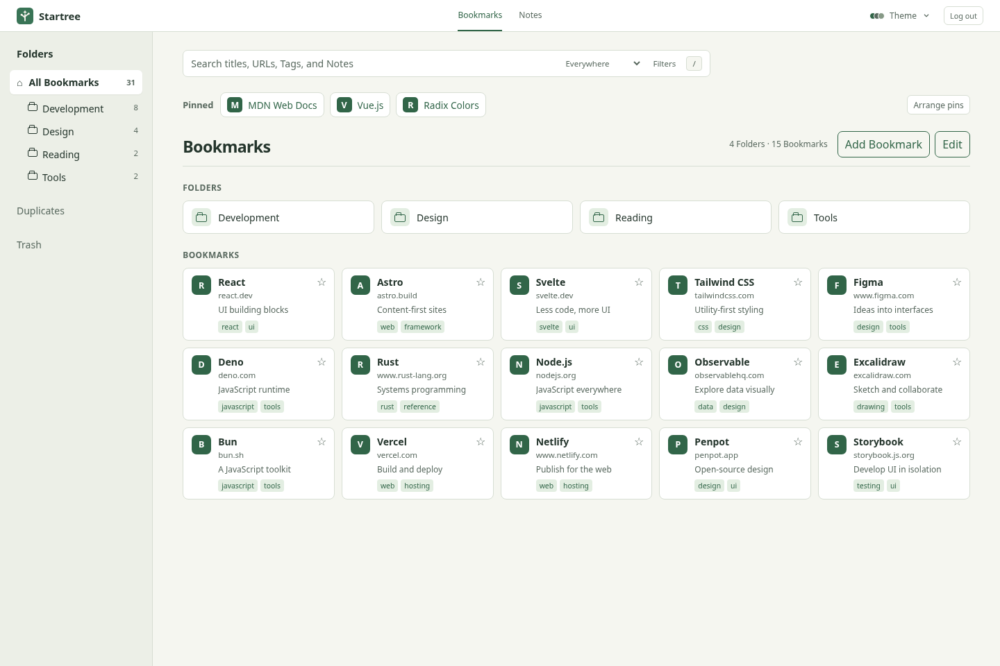

<p align="center">
  
</p>

<h1 align="center">Startree</h1>

<p align="center"><strong>Your bookmarks, independent of your browser.</strong></p>
<p align="center">A self-hosted start page with searchable bookmarks and encrypted private notes.</p>
<p align="center">
  <a href="#features">Features</a> ·
  <a href="#deploy">Deploy</a> ·
  <a href="#develop">Develop</a> ·
  <a href="#documentation">Documentation</a>
</p>

Switch browsers without moving your bookmarks or setting up another sync service. Startree keeps one library at your own URL, ready to open in whichever browser you use. Set it as your start page, or use it as a new-tab destination where your browser supports one.

Folders, tags, pinned bookmarks, and full-library search give you more ways to organize and find things than a browser bookmark menu. A separate encrypted notebook keeps private writing in the same workspace.

<picture>
  <source media="(prefers-color-scheme: dark)" srcset="docs/images/bookmarks-dark.png">
  
</picture>

## Features

|                 | What you can do                                                                                                                                |
| --------------- | ---------------------------------------------------------------------------------------------------------------------------------------------- |
| Organize        | Nest folders, add tags and annotations, and drag bookmarks into order on desktop.                                                              |
| Find            | Search titles, URLs, folders, tags, and annotations. Narrow results by tag or domain. Open search with `/` or `Ctrl/Cmd+K`.                    |
| Keep close      | Pin bookmarks from any folder. Return to your last folder or revisit recently opened bookmarks.                                                |
| Manage          | Create and edit bookmarks in place, review exact-URL duplicates, and recover deleted items from Trash.                                         |
| Read offline    | Browse and search the library retained in your browser after an online visit.                                                                  |
| Write privately | Encrypt note titles, text, and version history in the browser. Save offline drafts, export encrypted backups, and recover with a separate key. |
| Make it yours   | Choose a theme and browse on desktop or mobile. Mobile bookmark browsing is read-only.                                                         |

Startree is built for one owner, not a shared team account. You host it on Cloudflare Workers and D1, with Cloudflare Access protecting the whole application. Bookmarks are stored unencrypted in D1; browser-side encryption applies to the separate Notes page, not bookmark annotations.

## Deploy

You need Node.js 22.18 or newer, npm 11, and a Cloudflare account with Workers, D1, Access, and a domain for production.

1. Fork and clone this repository, then install the pinned tools and browser used by release checks.

   ```sh
   npm ci
   npx playwright install chromium
   ```

2. Authenticate the bundled Cloudflare CLI, create separate preview and production D1 databases, and configure your database IDs and production hostname. Copy `deployment.example.json` to the ignored `deployment.local.json`, run `chmod 600 deployment.local.json`, and edit its IDs and domain. Follow [first-time deployment](docs/operations.md#first-time-deployment). No source or test changes are needed.

3. Protect **every path**, including `/api/*`, with Cloudflare Access before deploying. Startree has no built-in login and must not be exposed without Access.

4. Deploy preview first, then production.

   ```sh
   npm run deploy:preview
   npm run deploy:production
   ```

   If you use a named CLI authentication profile, prefix either command with `CF_PROFILE=your-profile`.

Both commands run the full verification suite and apply database migrations before deployment. Production also requires a clean commit already pushed to `origin/master` in your fork. See the [operations guide](docs/operations.md) for Access checks, release safety, and rollback.

## Develop

No Cloudflare account or private deployment file is needed for local development, tests, type generation, or CI verification.

```sh
npm ci
npm run db:migrate:local
npm run dev:worker
```

Open the URL printed by the CLI, normally `http://localhost:8787`. This runs the built client and API together against local D1. Use `npm run dev` for client-only hot reload.

| Command          | Purpose                                                                           |
| ---------------- | --------------------------------------------------------------------------------- |
| `npm run check`  | Check formatting, lint rules, and TypeScript.                                     |
| `npm test`       | Run unit and script tests.                                                        |
| `npm run build`  | Build the client and service worker.                                              |
| `npm run verify` | Run the full release checks, including local Worker and browser acceptance tests. |

Before running browser checks, install Chromium with `npx playwright install chromium`.

The client uses Vue 3 and TypeScript. Hono serves the API from the same Worker, D1 stores authoritative data, and IndexedDB retains local copies. MiniSearch runs bookmark search in a Web Worker.

Start with `src/client/` for the UI, `src/server/` for the API, and `src/shared/` for validated contracts. Database migrations live in `migrations/`; release and verification tools live in `scripts/`.

## Documentation

- [Operations](docs/operations.md): provisioning, Access policies, deployment, and rollback.
- [Private Notes](docs/private-notes.md): saving, offline drafts, recovery, and backups.
- [Encryption design](docs/encrypted-notes-design.md): algorithms, trust boundaries, synchronization, and limits.
- [Data and privacy](docs/data-and-privacy.md): server storage, browser retention, and diagnostics.
- [Domain terminology](CONTEXT.md): the concepts used throughout the codebase.

Screenshots use synthetic example data.
